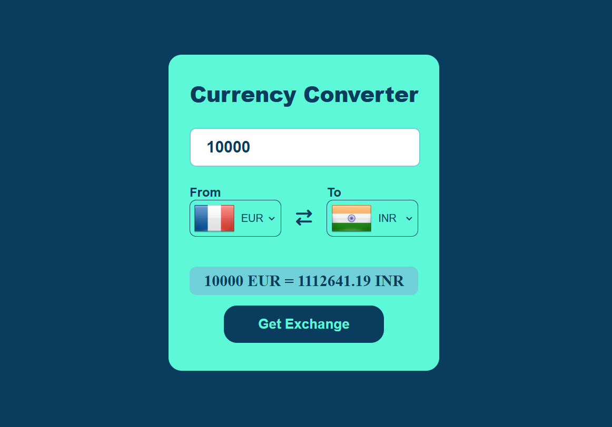

# Currency Converter 💱

A modern, responsive, and easy-to-use Currency Converter web application built with vanilla JavaScript. It provides real-time exchange rates for various global currencies.

## 🚀 Features

- **Real-time Rates:** Fetches the latest exchange rates using a reliable API.
- **Flag Integration:** Automatically updates country flags based on the selected currency using [FlagsAPI](https://flagsapi.com/).
- **Swap Functionality:** Quickly swap "From" and "To" currencies with a single click.
- **Responsive Design:** Works seamlessly on both desktop and mobile devices.
- **Clean UI:** Simple and intuitive interface for a better user experience.

## 🛠️ Tech Stack

- **HTML5:** For structured content.
- **CSS3:** For modern and premium styling (custom fonts, gradients, and layouts).
- **JavaScript (ES6+):** For dynamic functionality and API integration.
- **API:** [Fawaz Ahmed's Currency API](https://github.com/fawazahmed0/currency-api) for exchange rates.

## 📂 Project Structure

- `index.html`: The main entry point of the application.
- `style.css`: Contains all the styling for the application.
- `app.js`: Contains the logic for fetching data and updating the UI.
- `codes.js`: A mapping file for currency codes and country codes.
- `screenshot.png`: Preview of the application.

## ⚙️ How to Run

1. Clone or download this repository.
2. Open `index.html` in any modern web browser.
3. Enter the amount, select the currencies, and click **Get Exchange**.

## 📄 License

This project is licensed under the [MIT License](LICENSE).

---
Developed with ❤️ by [SK NAIF ALAM](https://github.com/naifsheikh0808-collab)
